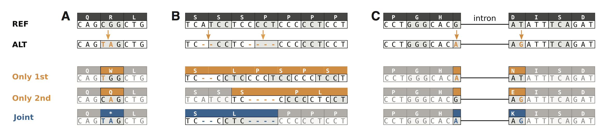
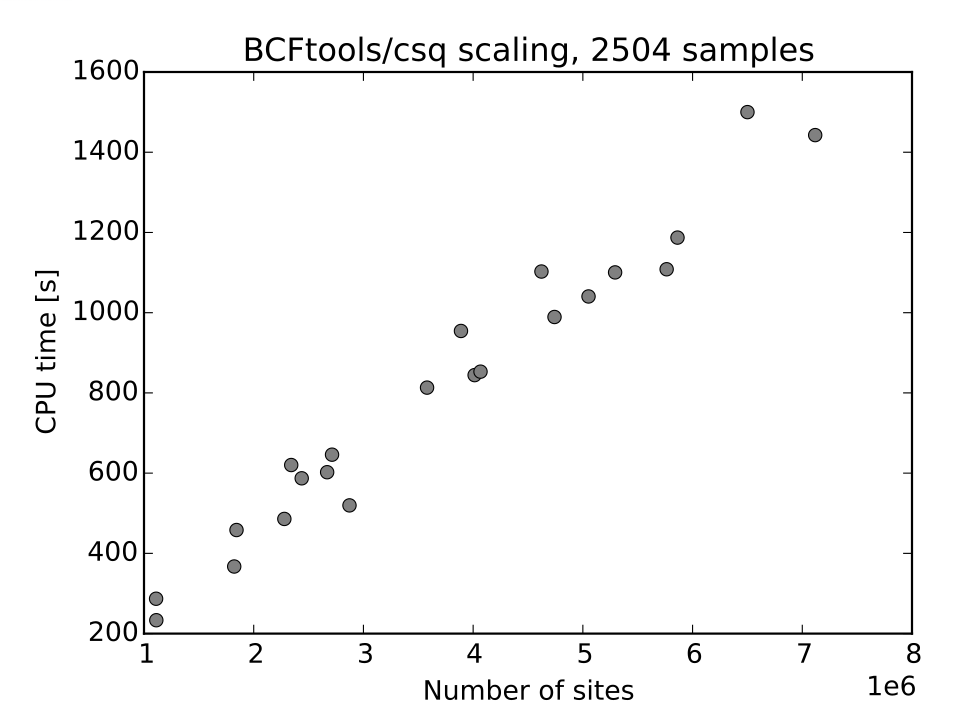
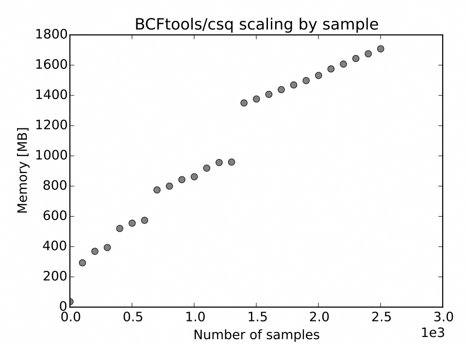
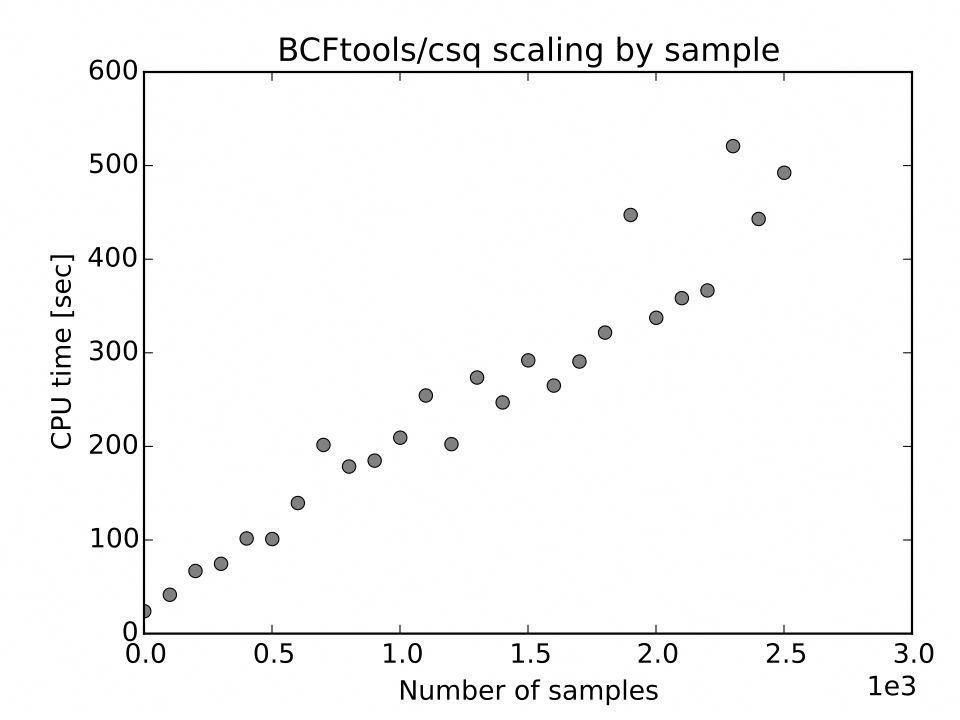
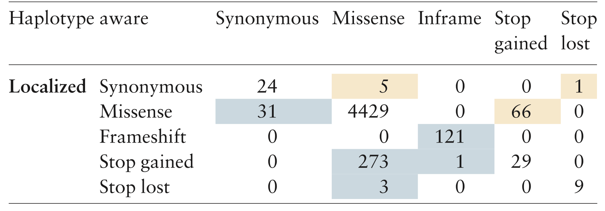

@(文献阅读记录)[BCFtools, samtools]
BCFtools/csq: haplotype-aware variant consequences
=======
目录：
[文献](https://academic.oup.com/bioinformatics/article-lookup/doi/10.1093/bioinformatics/btx100#supplementary-data)
[pdf](https://github.com/ChenYuelong/ReadBooks/blob/master/pdfs/BCFtoolscsq%20haplotype-aware%20variant%20consequences%20-%202017.pdf)

[TOC]

## 动机 ##
1. 目前的突变**功能预测软件（注释）**存在一些问题，就是他们（*ANNOVAR*）都是针对单行结果进行预测，而没有考虑到单体型等因素，可能得到incorrect结果。**VEP**的结果应该还不错。
2. 速度不快，内存消耗大
3. BCFtools/csq根据单体型信息来进行整合，去除这类错误。

## incorrect产生原因 ##
**对于突变结果，只会单行注释，而不会joint考虑。**

- A：多个突变在同一个codon中，将导致终止密码子的产生，而不是只是突变成了两种氨基酸而已。（*这种情况似乎和call variants的软件或者算法更相关，似乎没有见到过call认为这些突变单独出现的软件（mutect2），可能直接就放到indel中认为是delins了，这部分需要查验数据确认一下*）
- B：检测出来是连个移码突变，但其实综合起来考虑，应该是一个非移码突变。
- C：如果突变刚好在intron的两端，一般的注释软件不会识别他们其实改变的是同一个氨基酸，而是认为这是两个突变，分别进行注释，可能导致这样的错误**划重点**。

**这么考虑，这件事还是很有必要的，虽说A情况是否由call variants的算法或软件能够改进，但是第三种情况，肯定是需要改进的。**

## 材料和方法##
### 输入 ###
1. vcf文件
2. GFF3 file with gene predictions
3. reference FASTA file

### 原理 ###

> For each transcript we build a haplotype tree which includes phased genotypes present across all samples. The nodes in this tree correspond to VCF records with as many child nodes as there are alleles. In the worst case scenario of each sample having two unique haplotypes, the number of leaves in the haplotype tree does not grow exponentially but stops at the total number of unique haplotypes present in the samples. Thus each internal node of the tree corresponds to a set of haplotypes with the same prefix and the leaf nodes correspond to a set of haplotypes shared by multiple samples. Once all variants from a transcript are retrieved from the VCF, the consequences are determined on a spliced transcript sequence and reported in the VCF

## 结果 ##
1. 在NA12878数据上与VEP对比，在1.6M的突变中只有11个与VEP产生了差异。
>Differences:

| 位置      |     VEP |   BCFtools   |
| :--------: | :--------:| :------: |
| 2:220462640   |   start_lost |  missense\|STK11IP\|ENST00000295641\|protein_coding\|+\|1R>1M\|220462640G>T |
|5:95865526|start_lost|missense\|STK11IP\|ENST00000295641\|protein_coding\|+\|1R>1M\|220462640G>T|
|  6:26370748|start_lost|missense\|STK11IP\|ENST00000295641\|protein_coding\|+\|1R>1M\|220462640G>T|
BCFtools is correct here, the start codon is not M and these apparent start lost events are in transcripts with incomplete CDS

这三个认为是BCFtools的更准。

>
| 位置      |     VEP |   BCFtools   |
| :--------: | :------:| :------: |
|5:135513085 |frameshift | splice_acceptor|
 | 11:67765163 |frameshift|  splice_donor|
  |16:76311602 |frameshift | splice_acceptor|
  |17:46115122 |frameshift  |splice_acceptor|
  |15:99646107| frameshift  |splice_donor|
ambiguous cases in 2-3bp introns. Insertions can be counted either as part of the exon or the intron and be thus called as frameshifts or splice events. Note that the introns also have non-canonical splicing, the gene prediction may be wrong anyway.

这一部分就是比较不好判断的，因为刚好在交界处，可以认为是影响intron也可以认为是影响cds。

>
| 位置      |     VEP |   BCFtools   |
| :--------: | :------:| :------: |
| 5:157094796 |splice_region |  intron|

也是一个不好判断的，和比对相关，可以认为是比对到intron，也可以说比对到splicing。

2. 性能（VEP，ANNOVAR）比较也是在NA12878上进行的测试
>

| 性能     |     VEP      |snpEff|ANNOVAR|csq（local）|csq（haplotype）
| :--------: | :--------:| :------: |:------: |:------: |
| CPU time   |   6 hs |  35 min  | 24 min| 101 sec| 92 sec|
|Memory| 17 GB | 7.8 GB| 3.9 GB |207 MB| 208 MB|

可以看出性能上的差异相差还是挺大的。
BCFtools性能展示：
-  
- 
- 
- 

3. 1000 Genomes 中的复杂突变

*行表示用原始方法进行注释获得结果，列表是bcftools获得的注释结果。蓝色表示严重程度减少，黄色表示严重程度增加。如单行注释突变是无义突变（很严重），但“真实”注释成了同义突变（几乎无伤），就认为严重程度减少*。

## 小结 ##
1. 个人觉得这个方法的改进还是很有用的，对于有些突变可能由于某些原因导致注释错误，会影响判断。
2. 对于call snp算法或程序的改进，认为mutect2应该不会做相关的整合，因为输入的时候并没有给出单体型的信息，不可能单纯的因为距离相近就整合到一起，倘若一个碱基发生突变刚好是cds区域最后一个区域，另一个碱基和他只相差2bp的位置，但是已经出了cds区域，不可能整合到一块。所以这一部分通过这个软件来进行调整还是有所必要。
3. 可以尝试。

