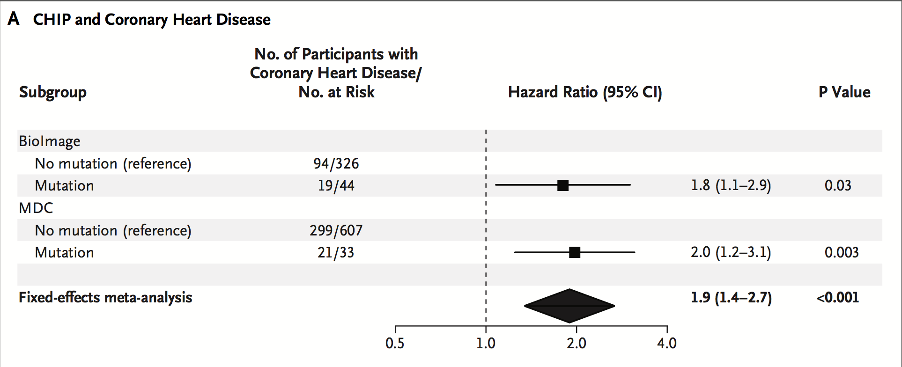
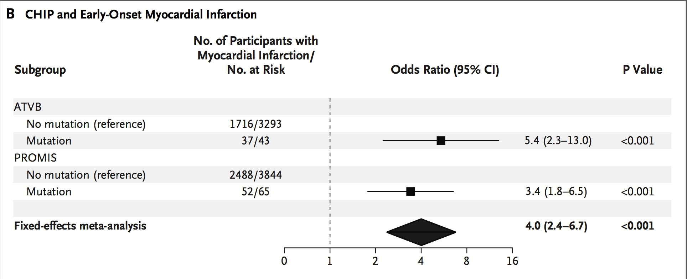
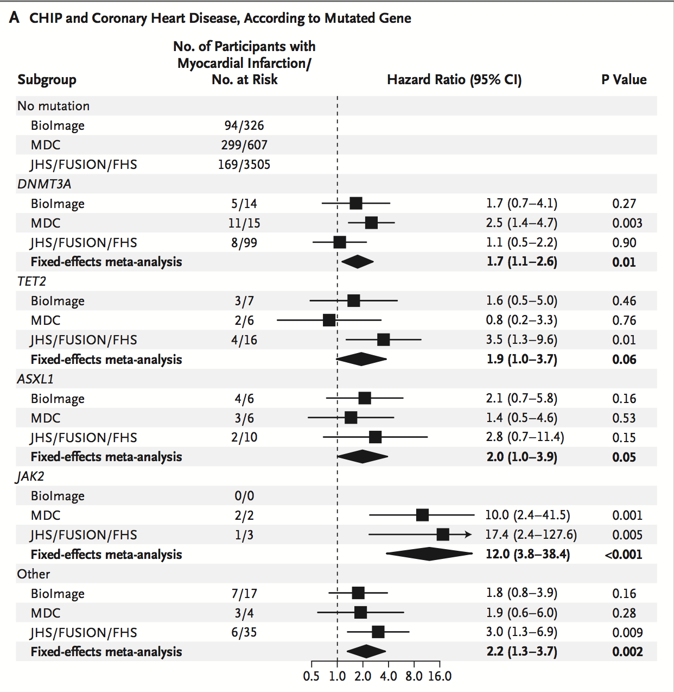
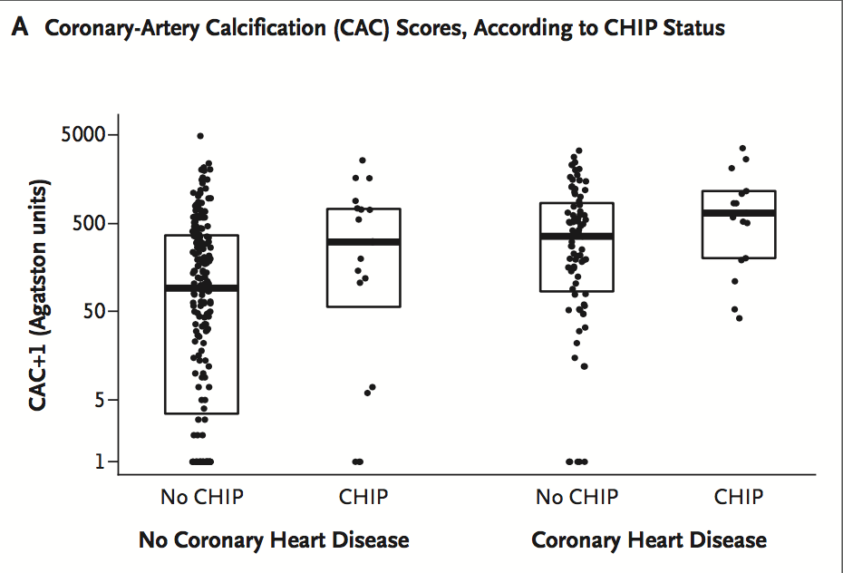
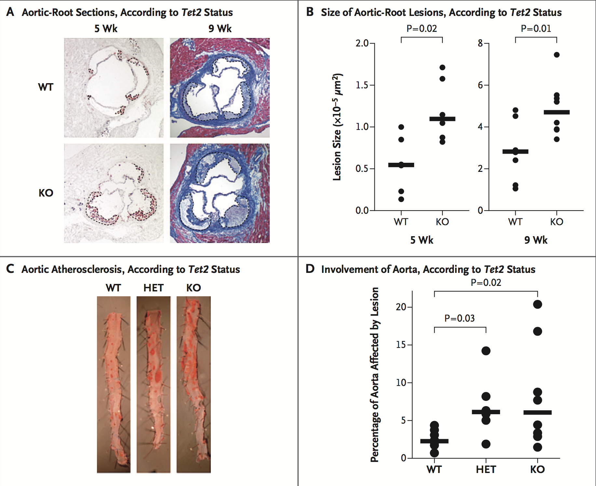

[toc]

[文献](http://www.nejm.org/doi/10.1056/NEJMoa1701719)

**克隆性造血**：

>Clonal hematopoiesis of indeterminate potential (CHIP), which is defined as the presence of an expanded somatic blood-cell clone in persons without other hema- tologic abnormalities, is common among older persons and is associated with an increased risk of hematologic cancer. We previously found preliminary evidence for an association between CHIP and atherosclerotic cardiovascular disease, but the nature of this association was unclear.

很有意思一点，就是排除了常见的心脏疾病，认为这些疾病的患者可能与基因的关系不大。但是有可能并不是设计实验的时候就发现这个问题，而是分析后发现结果中存在这样的问题，才提出的解决方案。

>After the exclusion of participants with prevalent cardiovascular events

## result ##

### Association between CHIP and coronary heart disease

>In the samples obtained from the BioImage and MDC studies, we found that the somatic mutations most commonly occurred in the genes DNMT3A, TET2, and ASXL1 and that 72 of 77 participants (94%) with CHIP had a mutation in only a single driver gene.

**DNMT3A，TET2，ASXL1**都是血液病相关基因
**大部分都只有一个CHIP突变**

1. 获得的结果中能看出有冠心疾病的与无冠心疾病的含有CHIP突变的差异。

### Association between CHIP and early-onset myocardial(心肌的) infarction（梗死）

>In ATVB, 37 of 1753 participants with myocardial infarction (2%) were CHIP carriers versus 6 of 1583 controls (<1%) (odds ratio, 5.4; 95% CI, 2.3 to 13.0; P<0.001)
>
>In PROMIS, 52 of 2540 partici- pants with myocardial infarction (2%) were CHIP carriers versus 13 of 1369 controls (1%) (odds ratio, 3.4; 95% CI, 1.8 to 6.5; P<0.001).

早期的心梗也有较显著的差异

### Association between risk mutations and coronary events

>Participants with mutations in DNMT3A, TET2, and ASXL1 had 1.7 to 2.0 times the risk of incident coronary heart disease as did those with no mutations, whereas the JAK2 V617F mutation was associated with 12.1 times the risk.

如果把不同的CHIP突变分开来进行评估，比如DNMT3A，TET2，ASXL1还有JAK2.其中JAK2的V617F有12.1倍的风险。

**其中的JAK2，可能会有更高的风险。**

### Association between CHIP and coronary-artery calcification（冠动脉钙化）

>Among those without incident coronary heart disease, CHIP carriers had a median score for coronary-artery calcification that was 3.3 times as high as that in noncarriers (306 versus 92 Agatston units)

**这强烈的说明的CHIP与冠动脉钙化有着强烈的联系**不论是在未有心脏疾病的组，还是在有心脏疾病的组。

注意左侧的Y轴刻度，并不是均匀的，在较高的部分，相差一点，score则相差较大。

### TET2 knockout mice and accelerated atherosclerosis ###

>We selected Tet2 for further study because it is the second most commonly mutated gene in CHIP and has been associated with the risk of coronary heart disease regardless of age

做了3组实验，（**TET2**）一组是正常骨髓移植老鼠，一组是杂合，一组是纯合knockout
结果如下：

_可以看出，TET2正常的老鼠主动脉正常，但是TET2的杂合缺失和纯合敲除，会是的主动脉的size显著增大，但是在外周血的白细胞计数中又没有显著的差异_

### Loss of TET2 function in myeloid cells ###

**这段中涉及到好多实验的设计，不太明白，待重读**

## DISCUSSION ##

1. 首先4个实验都说明了CHIP突变和冠心病活着早期的心肌梗死是有提高风险作用的。
2. TET2的功能缺失会加速动脉硬化（老鼠实验）

## 说明 ##

这篇文献还需要找时间再详细阅读，有些重要的点没有把握住。