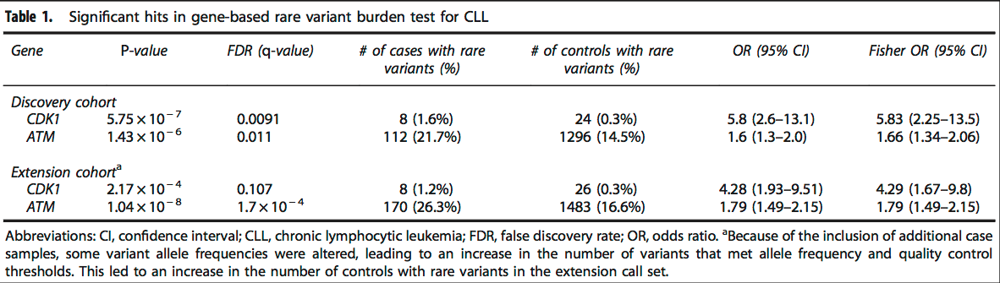
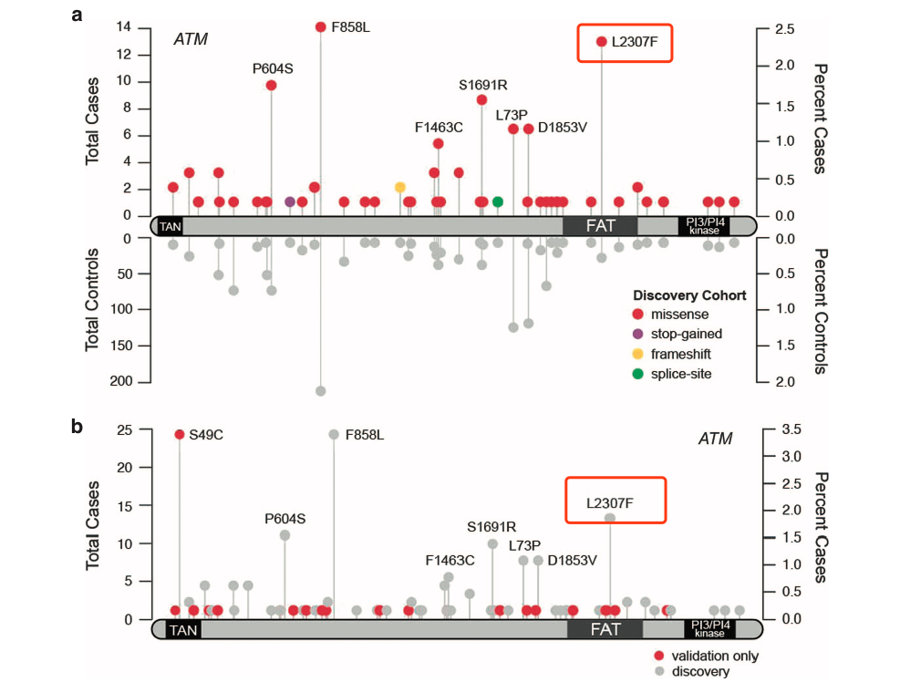

>Chronic lymphocytic leukemia (CLL) is a highly heritable cancer, with a 7.5-fold increased risk in first-degree relatives

**第一次听说leukemia是遗传的。之前一直认为血液病（白血病）是由于体细胞突变造成的。**

但是目前对于这种germline突变的研究并不是很明确，作者提出了一个假设，这类相关的germline突变很可能是发生在rare coding variants（**minor allele frequency <0.01**）

作者为了获取足够的数据来探测或者证明这个猜想，获取了很多的测序数据，但是由于这些数据是来自于不同的 *人种*、 *平台*、 *测序深度*、 *call variants method*，为了具有可比性做了以下措施：

>(i) simultaneously processing original sequencing data from all cohorts; 
>(ii) jointly calling variants across all cases and controls; and 
>(iii) analyzing only ethnically matched, unrelated samples over DNA sites with sequencing coverage sufficient to achieve high-confidence genotype calls across the entire sample cohort.

1. 直接处理最原始的测序数据
2. 联合call variants across all cases and controls(待详细说明)
3. 只分析人种match的

## 结果 ##

1. 发现两个与CLL（q<0.05）的基因：CDK1&ATM
2. 而且各发现一个位点

## 提示 ## 

1. 做WES项目的时候也可以考虑这一方面。

