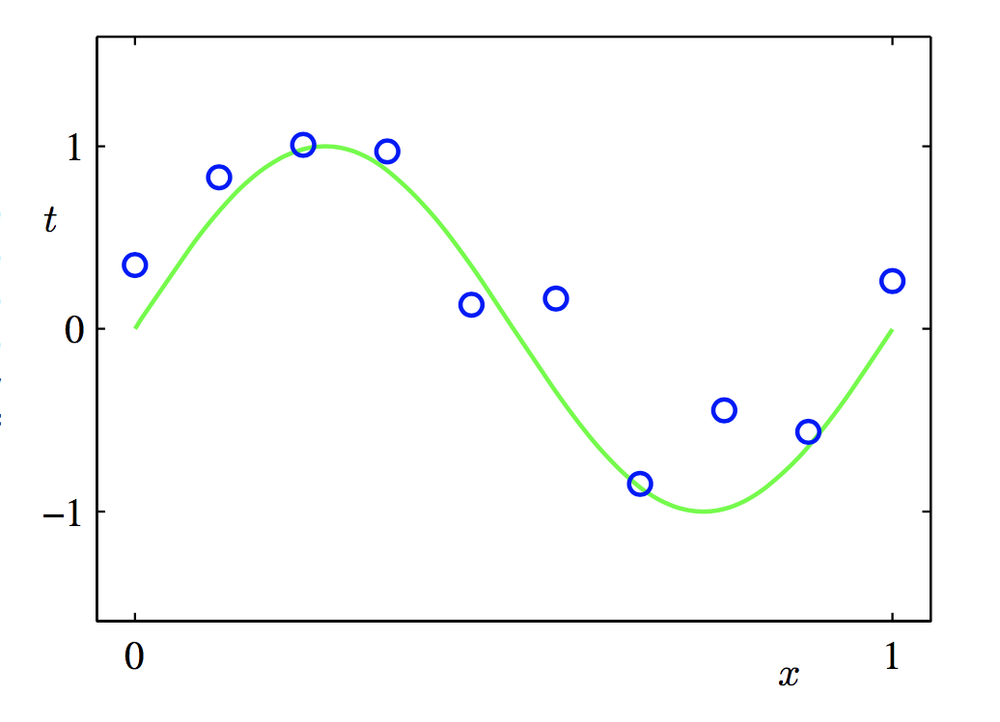
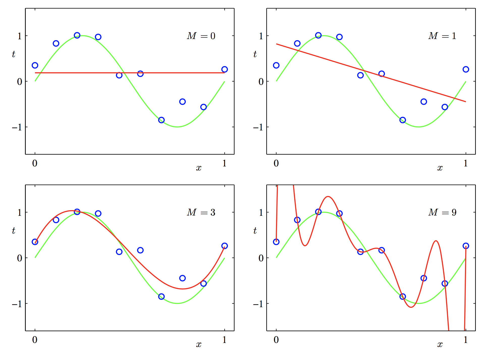
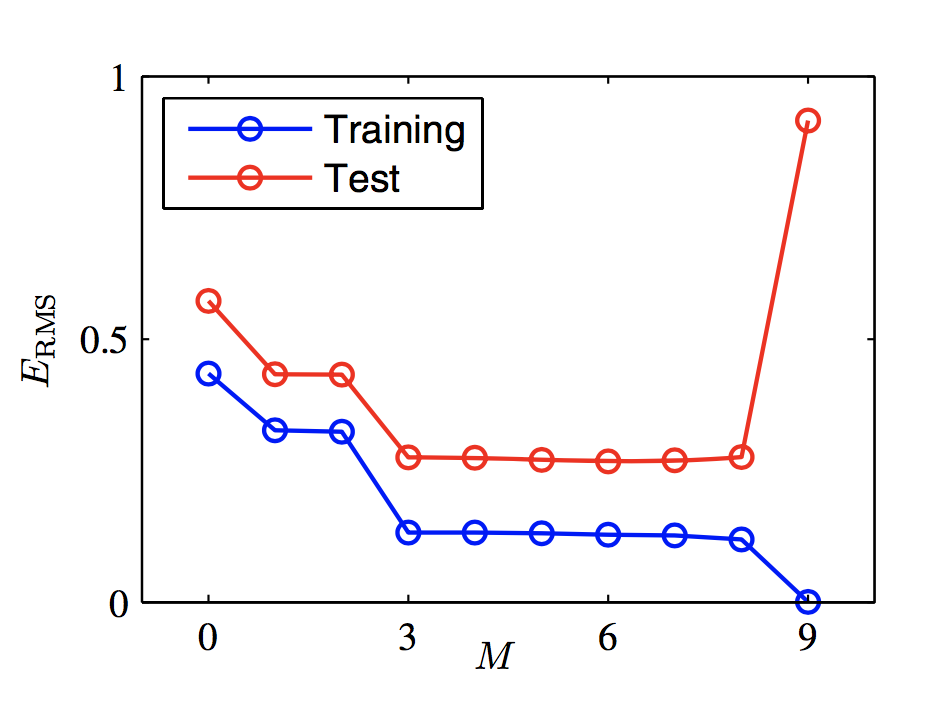
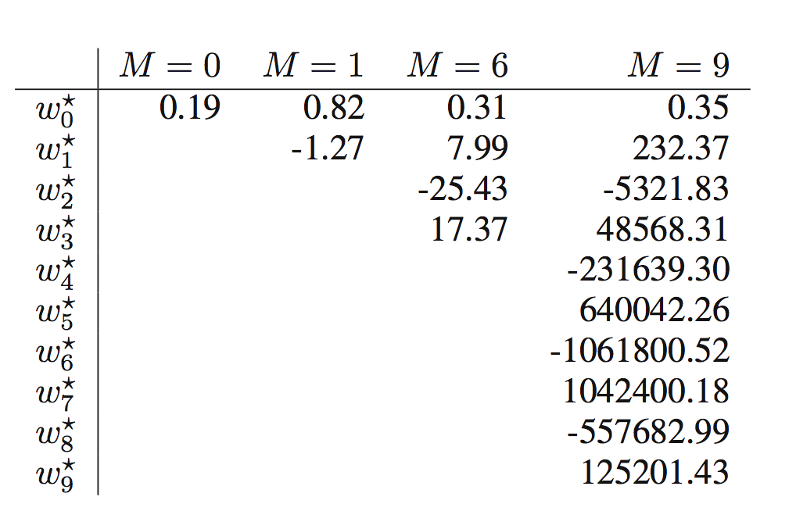

#Pattern Recognition and Machine Learning#

---

[toc]

---

## 数学符号 ##

**为了方便以后查阅，我决定还是记录一下**

向量（Vectors）用小写字母表示`x`，有一个上角标T，例如$$x^T$$表示的是行向量（row vector）。大写的字母`M`则表示矩阵，$$(w_{1},...,w_{M})$$表示有`M`个元素的行向量。

`[a,b]`表示闭合区间，`(a,b)`表示开区间，`[a,b)`则表示左闭右开的区间。

`M x M`的单位矩阵，用$$I_{M}$$表示，也就是对角线上的元素都是1，非对角线上的元素都是0.

$$g(x) = O(f(x))$$表示当$$x->\infty$$时函数的边界。`f(x,y)`关于`x`的期望，$$\mathbb{E}_{x}[f(x,y)]$$如此表示。

## 1 INTRODUCTION ##

1. **有监督的学习**
 1. 分类（离散target）
 2. 回归（连续target）
2. **无监督学习**
 1. 聚类
3. **提炼学习（reinforcement learning）**  我的理解就是这个其实是一连串的预测，但是每个预测都不知道结果，直到最后一步之后才能知道，这一列的预测得到的是好的结果还是坏的结果，反过来评估之前的每一步。对于之前知道的步骤（也就是学习过程中经历过的）叫利用（*exploitation*），对于新的步骤，之前没有学习过，就是开发（*exploration*），需要利用+开发合理的组合才能获得较好的结果。

### 1.1 Example:Polynomial Curve Fitting ###

这是一个经典的例子，首先说明什么是回归。

如图，图中的点是通过$$sin(2\pi x)$$再加上一些随机噪音生成的。

真是的数据如同图中绿色线一样，但是由于加入了噪音，所以针对每一个x，出现的是蓝色点代表的target。
如图中，均为训练集的话，那么$$x\equiv(x_{1},...,x_{N})^{T}$$为N个训练样本的变量，而$$t\equiv(t_{1},...,t_{N})^{T}$$表示这个N个变量所对应的target。

如果使用多项式进行fit，就会有如下形式：
$$y(w,x)=w_{0}+w_{1}x^1+w_{2}x^2+...+w_{M}x^M=\sum_{j=0}^nw_{j}x^j$$

`M`就是多项式的最高次项。该式虽说是`x`的非线性多项式，但是是`w`的线性多项式，所以还是可以称之为线性模型（linear model）。`w`这个向量，通过training set的fitting（拟合）来进行计算。可以通过`error function`的最小化获得`w`向量的值。
如果对于$$x_{n}$$对应的target值为$$t_{n}$$，那么我们的目的就是使下式最小：
$$E(x)=\frac{1}{2}\sum_{n=1}^N\{y(x_{n},w)-t_{n}\}^2$$

这个1/2并没有实际的意义，只是为了后续的计算简便。从式子中可以发现，该式是一个非负的值，最小为0，而且只可能在预测的值和本身的值刚好一样的时候，才会出现这样的情况。

**只是用这种式子的缺陷是很容易陷入过拟合（overfitting）**

如下图所示：

- 图一表示最高次数为0的，这种完全不存在拟合，属于拟合不好
- 图二表示最高次数为1，也是拟合不好
- 图三则是一种较好的拟合方式
- 图四虽说预测的点都经过真实的点，但是很显然不符合最初生成这些点的函数，是因为它随着随机噪音的波动有很大的影响，属于过拟合（overfitting）

**假设这种情况下，得到的参数为**
$$w^*$$

所以为了避免这种情况，更常用的是另一种the-root-mean-square(RMS) error,
$$E_{RMS}=\sqrt{\frac{2E(w^*)}{N}}$$

N为数据集的大小。

对比使用RMS来评估training Set和Test Set的错误，如下图所示：

可以看出即使在training set时，EMS error在M为9的时候降为了0，但是对于Test Set，却增大了很多，这也说明了M=9可能造成了Training Set的过拟合。（*因为之前给出的点，一共10个，所以当X的最高次为9的时候，刚好能够完全的拟合，但是对于测试集就完全不行了*）

还有一个问题，就是当x的最高次项次数越来越高的时候，系数的绝对值也越来越大，如下表所示：

可以发现，当M=9的时候，每个系数的绝对值已经特别大了。就会造成曲线的特别震荡。