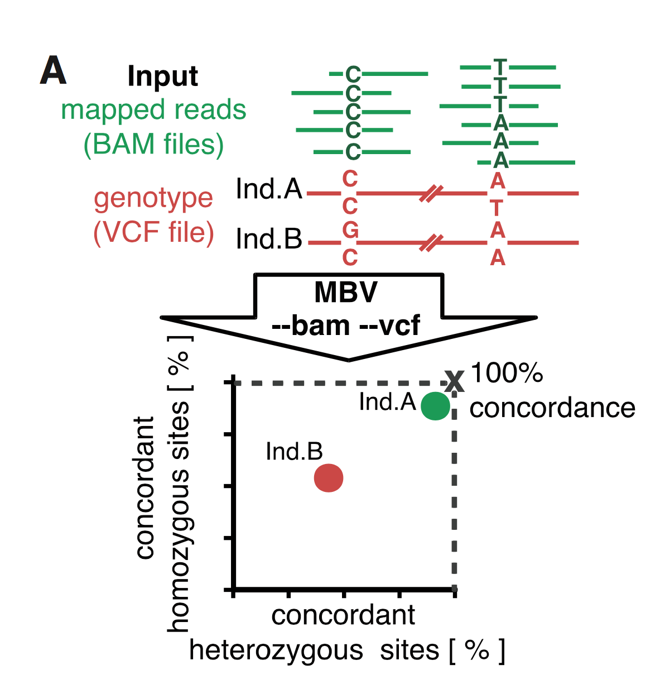
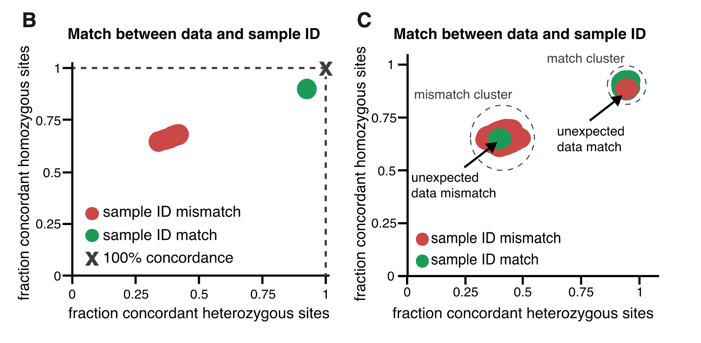
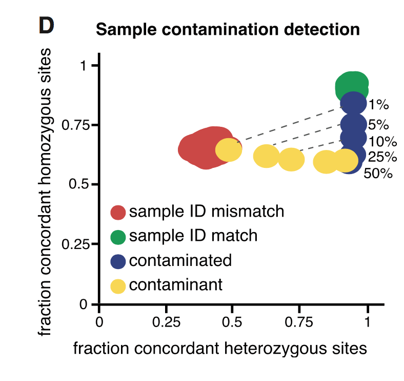
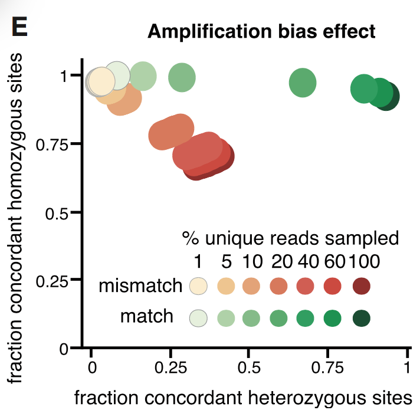

@(文献阅读记录)[MBV, mislabeling]
MBV: a method to solve sample mislabeling and detect technical bias in large combined genotype and sequencing assay datasets
========
[文献](https://academic.oup.com/bioinformatics/article-abstract/33/12/1895/2982050/MBV-a-method-to-solve-sample-mislabeling-and?redirectedFrom=fulltext)

[pdf](https://github.com/ChenYuelong/ReadBooks/blob/master/pdfs/MBV%20a%20method%20to%20solve%20sample%20mislabeling%20and%20detect%20technical%20bias%20in%20large%20combined%20genotype%20and%20sequencing%20assay%20datasets%20-%202017.pdf)

[toc]

## 动机 ##

1. 为了确保各种数据的样本对应关系正确（我有一个样本的全基因组的VCF文件，还有一堆bam，我要找出哪个bam才是这个vcf样本所对应的），方法叫 **MBV** 就是指 *match bam to vcf* 。
2. 如果vcf是全基因组的，而bam是其他数据（外显子捕获，RNA）那么还能大概的检查一下PCR amplication bias。
3. **可能可以看出样本污染情况**。

*感觉上这篇文章能发《bioinformatics》是因为有关系，这个看不出什么难度的方法都能发表*

## 材料和方法 ##

1. 输入：一个包含samples的vcf，一个要查验的bam。
2. 输出：

|sampleID|sampleMisGT|HeGT|HoGT|bamHeGT|bamHoHT|matchHe|matchHo|percentageHe|percentageHo|
| :--------: | :--------:| :------: |:--------: | :--------:| :------: |:--------: | :--------:| :------: |
|HG00096 |0| 23764| 61721| 175 |499| 91| 333| 29|
|HG00097 |0| 26639 |58846 |193 |481 |93 |317 |23|
|HG00099 |0 |27672 |57813 |216| 458| 93 |294 |26|
|HG00100 |0 |28267 |57218| 243 |431 |107| 281| 24|
|HG00381 |0| 27339| 58146 |213 |461| 204| 408 |28
|HG00106 |0 |26046 |59439 |190 |484| 90 |317 |30|
|HG00108| 0 |25408 |60077| 205 |469| 85 |297 |31|

>1. The sample ID in the VCF against which the sequence data has been matched
>2. The number of missing genotypes for this sample
>3. The total number of heterozygous genotypes examined
>4. The total number of homozygous genotypes examined
>5. The number of heterozygous genotypes considered for the matching, i.e. those that are covered by more than --filter-minimal-coverage 10 reads
>6. The number of homozygous genotypes considered for the matching, i.e. those that are covered by more than --filter-minimal-coverage 10 reads
>7. The number of heterozygous genotypes considered for the matching with fully matching sequence data
>8. The number of homozygous genotypes considered for the matching with fully matching sequence data
>9. The percentage of heterozygous genotypes considered for the matching with fully matching sequence data
>10. The percentage of homozygous genotypes considered for the matching with fully matching sequence data
>11. Dummy field

9，10 ，11列不太明白是什么意思，其他的都算是比较好理解。

利用第7列/第5列，第8列/第6列，就能得出一个大致的杂合纯合基因型match比例。如果对于VCF中每个样本都画在图中，就有如下效果：

* 图中的绿点就是match的，红点就是未match的。

3. mislabel结果：

*B 表示的就是sampleID没有出错。C就是表示又一个sampleID可能混了，所以导致绿色（假设是那个ID的bam得出的结果）在左边。*
4. 污染结果：

*实验者用已知的污染物进行测试，发现如上结果。*
5. PCR偏好结果：
>increasing amplification bias leads to decreased heterozygous concordance with no change in homozygous concordance 
如下图所示：

## 小结 ##

1. 觉得可以用到商业项目中，特别是对于体检项目，可以将之前所有的样本构建成VCF，然后再跑新一批次样本的时候运行一次这个检查，看有没有和之前相同的样本，然后同一批次内还可以在跑一次，这个时间成本需要评估来确定是否合理。
2. 对于所有的商业项目其实都可以这样进行，画图的时候，可以画之前所有的批次一个颜色，同一批次一个颜色，本身对应的ID一个颜色，就可以试试能不能查看出污染及重复样本。
3. **PCR偏好这块还是没有太懂，需要再关注一下。**

