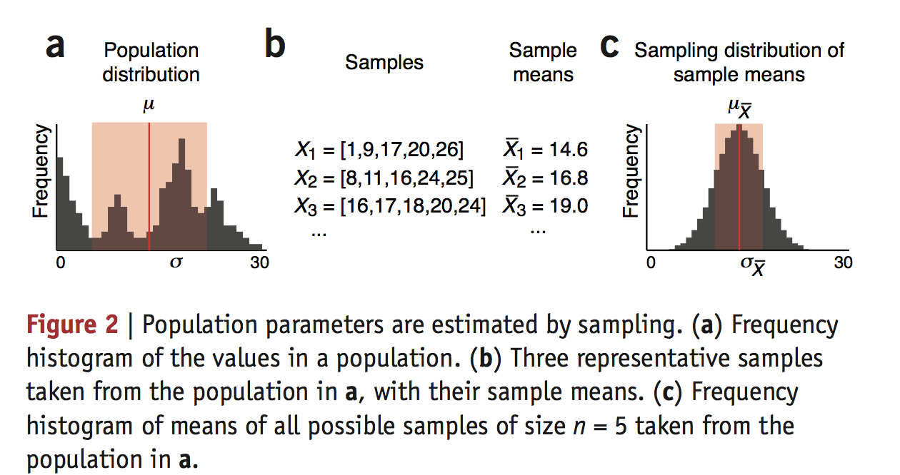
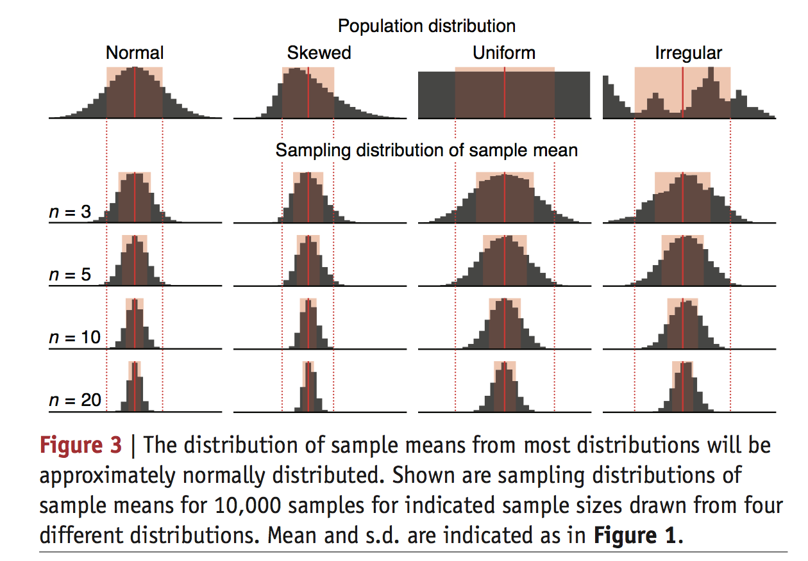
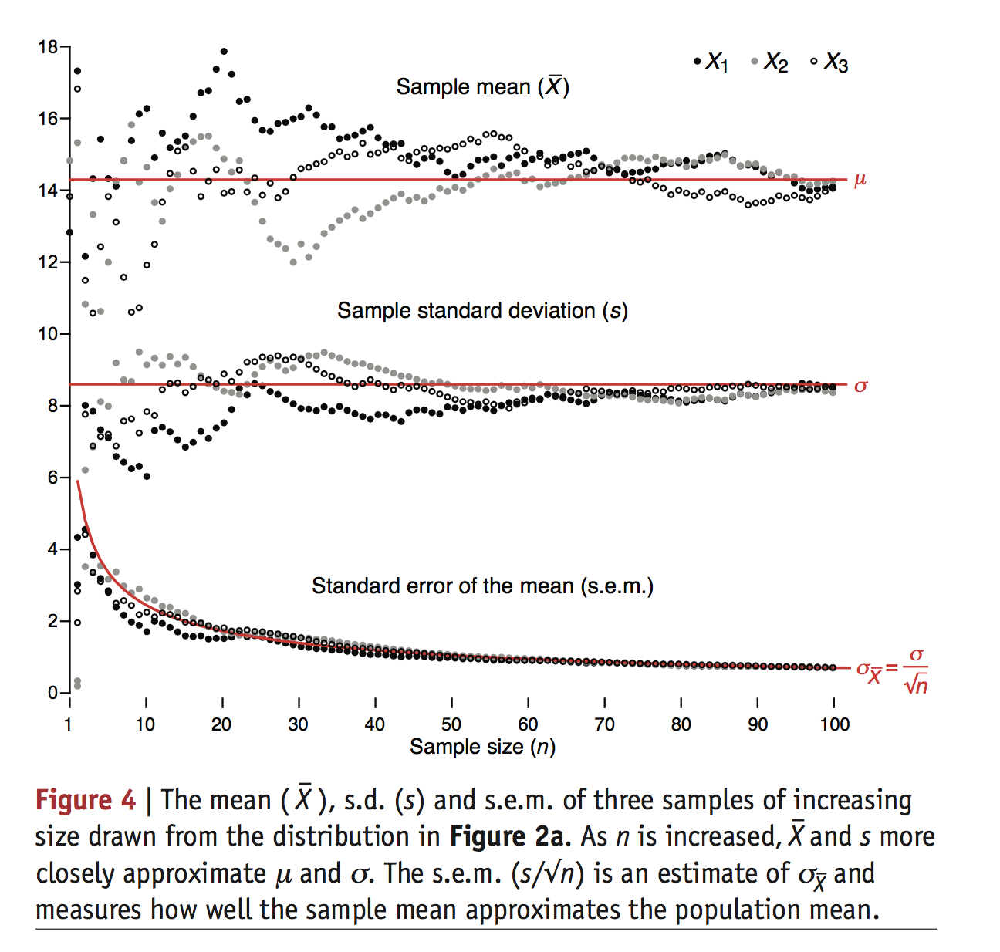

**陈利斌分享-20170721**

>statistics does not tell us whether we are right. it tells us the chances of being wrong

*并非告诉我们是否是对的，而是有多大的可能性是错的*

而且这个系列（Points of Signatures），就是因为很多的医学文章中的统计方法使用的并不正确。

这篇文章又一个观点需要注意，就是不论总体是什么样的分布，多次从总体中抽取出来的样本集的均值，一定符合正态分布

**其实可不可以说，我们通过这个均值的正态分布的标准差来判断总体的分布是否广泛**

>Samples are our windows to the population

这句话说的特别好

说明上面的那个问题，
这是一个很好的例子，就是不论总体是什么样的分布，他的样本集的均值都是符合正态分布，而且随着样本集中的个体数目的增加，均值的分布的标准差，方差会变小。
图中的n表示的每个样本集中的个体的数目。做每个图，都是从总体中抽了10000个样本集。

上面这张图就刚好说明了我之前的疑问
（*其实可不可以说，我们通过这个均值的正态分布的标准差来判断总体的分布是否广泛*）

在每个样本集中的个体数目一定的情况下，样本均值的分布的方差就是和本身总体的方差相关的。

