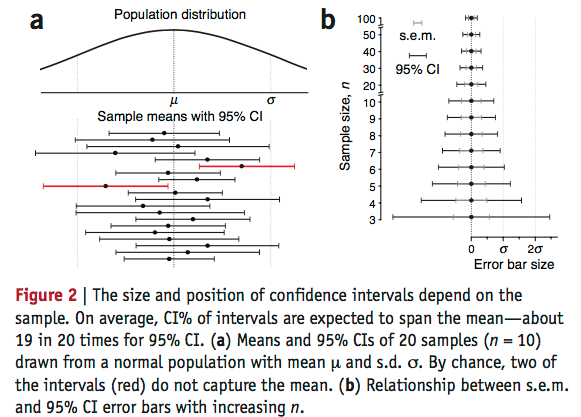
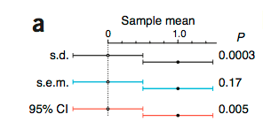
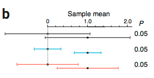

**这是篇很有意思的文章，却是我之前从来没有注意过error bar的内容**

>the meaning of error bars is often misinterpreted, as is the statistical significance of their overlap

Error Bar一般是三种表现：

- standard deviation(s.d.)
- standard error of the mean(s.e.m.) 
- confidence interval(CI)

### s.d. ###

就是标准差，这个接触的比较多。

### s.e.m. ###

俗称标准误，与样本数相关，$$\sigma_{\overline{X}} = \frac{\sigma}{\sqrt{n}}$$

### CI ###

CI是指样本均值的置信区间，因为样本的均值是符合正态分布，而且是与s.e.m显著相关的，而s.e.m.是与样本数目显著相关，一般95%的置信区间可以理解为 **样本均值的均值加减二倍的s.e.m.**

>two useful approximations for theCIare95%CI≈4×s.e.m(n=3)and95%CI≈2×s.e.m.(n>15).

和我所说的还是有一点区别，看来还是在CI的计算上的差别。

图中能够很好的说明这个问题

**由于本身样本集可能不符合正态分布，所以CI不是样本均值加减二倍的标准差**

文中给出了一个例子，现在有两个独立的样本集，他们的均值分别是0和1，从中各抽出10个样本，然后分别计算s.d./s.e.m./CI

认为的选择样本，使得这三个都为0.5

可以看出，通过这样的样本集，利用T test进行检验，他们的P值是完全不同的。

虽说以这三种表现形式出来的error bar都是刚好接触，但是证明他们两组样本集是否显著差异的显著程度完全不同。

而固定P值，同样进行样本的选择。我们发现error bar的长短完全不同，即便都是p=0.05，明显s.d.的error bar即便有很大一部分的overlap还是显著差异的。

可见三种表现形式，即便视觉上没有差异，可能在真正含义中缺有很大的差异。反之亦然。

> In general, a gap between bars does not ensure significance, nor does overlap rule it out—it depends on the type of bar.

>CIs are a more intuitive measure of uncertainty and are popular in the medical literature.

其实CId对于不太思考，而直接从图中获取信息来说是最直观的。

对于s.e.m.，又一个不太好的消息，即便error bar不overlap也不能说明两组values的差异。

>“if the s.e.m. bars do not overlap, the difference between the values is statistically significant” is incorrect. 

