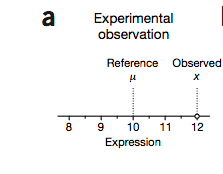
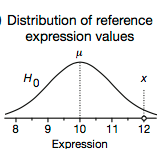
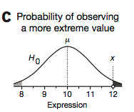
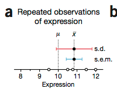
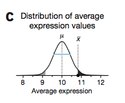
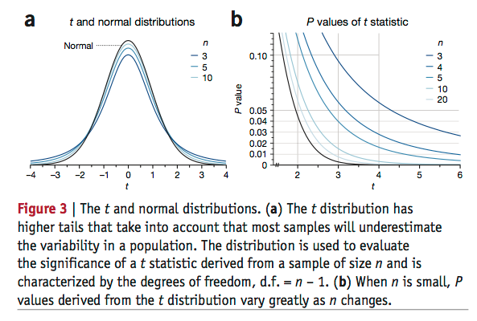

>the P value reported by tests is a probabilistic significance, not a biological one.

这篇读完真的有点深受启发，觉得自己之前的统计学知识真的有点烂，虽说还是有些地方没有弄的特别明白，不过也差强人意了。

## Significance ##

假设我们在一个细胞系中测量了某一个蛋白的表达量，expression value `x=12`，而之前，我们其实知道这个细胞系中的这一蛋白的表达量（前人的实验，反正测了很多次），均值`u=10`，我们如何来描述，我们测到的这个`x=12`是随机发生的，还是因为实验条件差异而导致的。

我们通过前人的研究呢，发现之前测量的表达值是有波动（fluctuations）的，而且假设他是服从正态分布

我们可以通过正态分布来计算，我们这次所观察到的这个`x`，他在零假设（H0）的分布下，发生的可能性是多大。也就是在正态分布中，获得一个`x`这样的值，及比他更偏离的值，的概率。

我们认为这个概率就是P value，但是这个P value所表示的意思是：

>P value is often misinterpreted as the prob- ability that the null hypothesis (H0) is true

**在H0这个分布下，我们得到x这个值的可能性**
完全不等价
*我们得到x这个值，他是来自于H0这个分布的可能性*

这种错误产生的原因是，我们很武断的认为事物的两面性，即在这一类中，该事件的发生可能性很低，那么在另一类别中，它发生的可能性就一定很高。
这个问题很值得一说，因为刚刚在读文章的时候，我在这方面想了很久。

*假设，我们现在知道人类只分成了两种，一种男人，一种女人，然后我们统计了全世界所有男人的身高，发现原来符合正态分布，均值为u男，波动（方差）为sigma男，现在我们又获得了一个人的身高，2.2米，然后我们构建一个零假设，H0:这个人是男人，备择假设：这个人不是男人，即这个人是女人。而在全世界男人的身高分布中，我们发现，在男人群中只有1%的人的身高能大于2米，也就是p value是小于0.01的，我们现在的结论只能说明，在H0的这一情况下，我们获得这个x的可能性是0.01，但是不能说（这个x有0.01的可能性是属于男性。或者说，我们的H0有0.01的可能性是正确的）这种错误的结论。因为在女性群体中，获取这样一个x的可能性可能都不到0.00001，正常来说，这个人还是属于男人。*

**所以在生物学问题中，进行P值解释的时候，就需要注意这个问题**

>Statistical significance suggests but does not imply biological significance.

## P value ##

而目前，我们针对这样的数据只能获得这样的结论，但倘若我们还需要更加详细或者信息量更大的结论，那么我们还需要做一些数据的补充。
例如，我们再把这个细胞系的这一蛋白表达再测几次，假设一共测了5次（n=5）

图中还给出了POS2-error bar中的两种error bar

获得了均值(x=10.85)，标准差(0.96)，获得了这样的数据，我们就可以用均值是否差异进行计算P value。前面已经说了，我们已经知道了总体的标准差，那么也就知道了均值分布的标准差（s.e.m.：应该记得怎么计算，和样本数相关的那个）

这样就可以通过这个分布再计算，是否均值没有差异。并获得P值。

## t-test ##

>To avoid the nuisance of dealing with a sampling distribution of means for each combination of population parameters, we can transform the mean x ̄ to a value determined by the difference of the sample and population means D = x ̄ – m divided by the s.e.m. 

T-test就是在此基础上发展而来。有关于T-test需要后续专门总结一番，所以在此酒不进行描述了。

