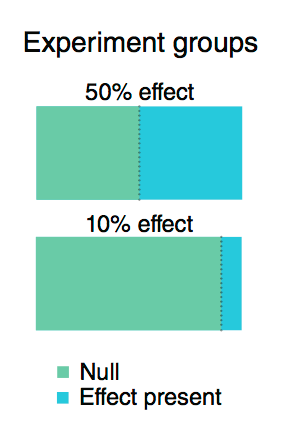
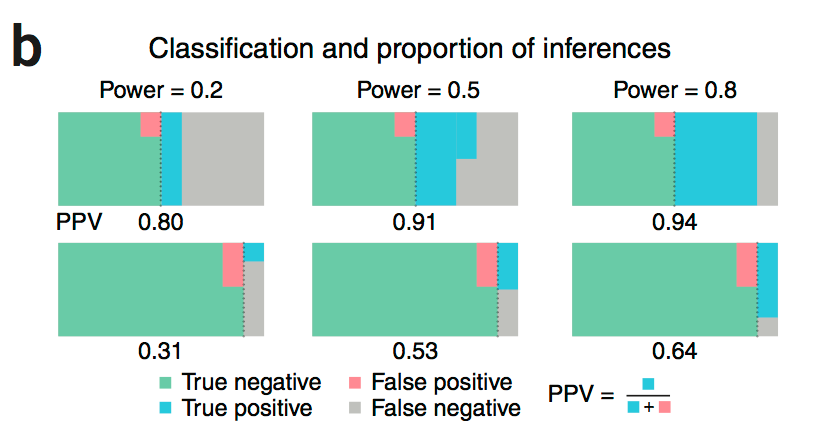
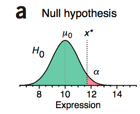
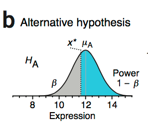
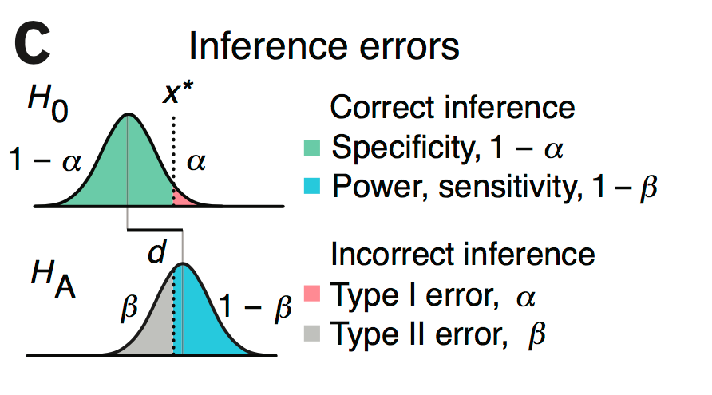
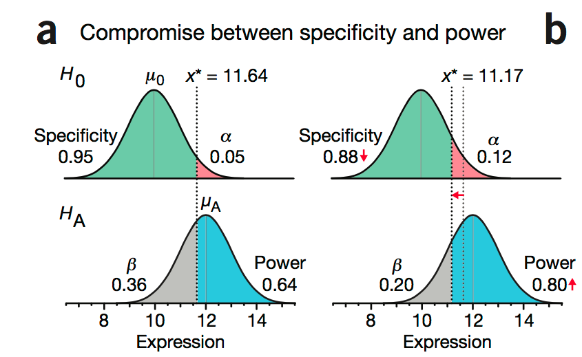
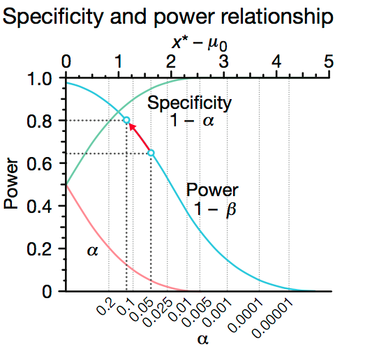

>The ability to detect experimental effects is undermined in studies that lack power

_这篇文章读的我酣畅淋漓，感觉进入了一个新世界，可见我之前的统计世界多么渺小_

## Statistical Power（统计功效） ##

Power是个之前完全没有接触过的词汇

>统计功效，简单说就是真理能被发现的可能性。就像胰岛素能降低血糖这事是真实存在的，但人类能发现它的概率是多少？如果统计功效是0.8，就是说人类有80%的概率能发现它。

而我对他的理解，就是对于一件真的事情，我们有多大的功效能够判定他为真。就像上面引文中说的，或者更简单点，一个人有糖尿病，我们能够检测出他就是有糖尿病的概率是统计功效。

**一般我们用power=1-\beta来表示**

`\beta`就是第二类错误（假阴性）发生的概率。

而影响这个power的因素有主要的三个：

1. 效应量（d）,两组样本均值差异，$$d=\frac{u_{1}-u_{2}}{\sigma}$$，有的时候也和样本量相关，乘以样本量开方
2. 样本量 ，有一个专门计算的网站，似乎对于不同的检验方法有着不同的计算公式，[http://powerandsamplesize.com/Calculators/Test-1-Proportion/1-Sample-Equality](http://powerandsamplesize.com/Calculators/Test-1-Proportion/1-Sample-Equality)
3. `\alpha`水平，一般为0.05，就是假阳性，第一类错误发生的概率

我先说明一下power

我们假设两种状况
第一，我们做了100个糖尿病患者，然后其中50个是注射了胰岛素的，然后我们测了他们过了一段时间之后的血糖x，这个就是我们的测量量。
第二，我们还是做了100个糖尿病患者，我们只有10个胰岛素的经费，所以只有10个糖尿病患者是注射了胰岛素，然后我们也测量了他们的血糖，x是测量量。

如上图所示，蓝色的就是注射了胰岛素的，绿色的就是没有注射的。

现在假设我们的`power=0.2``power=0.5``power=0.8`，来看我们会得到什么样的结果。我先来说明一下计算，就是第一种情况，我们一共有50个样本是注射了胰岛素，而我们的`power=0.2`，就是我们只能检测出50*0.2的样本是有作用的，大概10个样本，其他的注射过的样本均会被评估成未注射过的。

下图中涉及到的假阳性后面在解释，目前暂把其当作定值，所以上述两种状况及三种power值，我们将获得下图结果：

我详细解释其中的一个，就拿`Power=0.2`为例，在第一种实验条件下，我们能检测到

1. 注射了胰岛素的并被检测出来的（TP）:50*0.2=10
2. 注射了胰岛素缺没有被检测出来(FN):50*(1-0.2)=40
3. 未注射胰岛素却被检测出来（FP）:50*\alpha=2.5
4. 未注射胰岛素也没有检测出（TN）:50-2.5

而我们知道positive predictive value, PPV的计算

$$PPV=\frac{TP}{TP+FP}$$

那么第一种试验在power=0.2的情况下，**PPV=0.8**
而同样的计算方法，第二种试验在power=0.2的情况下，**PPV=0.31**

是不是看着很大的差异，几乎同样的功效下，结果却差别这么大，如果注意上图中所示的，即便在功效的提升过程中，由于试验阳性样本的缺少，还是会导致实验二的PPV结果很差，而为了获得很好的结果只能追求更小的 **\alpha**

所以为了获得合理且可信的结果，需要一定量的数据量来支持，而这个数据量也是《Nature》会注意到的问题

>“How was the sample size chosen to ensure adequate power to detect a pre-specified effect size?” 

## 一个实际的例子 ##

上一篇的时候（signaure，P value，t-test）我们提到一个例子，有关蛋白表达的，这里继续使用这个例子。假设之前的这一蛋白是符合一个分布，如下图所示：

图中红色的区域就是我们的拒绝区域，也就是\alpha，倘若我们新的一次试验，测得这个蛋白的表达x刚好大于，这个x*，那我们就会拒绝原假设，认为我们这个x不符合之前得到的这个蛋白的分布，可能是由于试验条件的改变而造成的改变（例如，使用了某种药物刺激），但还是有一定犯错的可能，但是犯错的可能性就是`\alpha`，那么如果这个蛋白通过某种药物的刺激，她会造成改变，他不属于原有的那种分布，那么他一定属于一个新的分布，假设它属于的那个分布就是H1，如下图所示：

这个新的分布和原有分布的差异就是表达的均值有些差异。

图中，上面是H0的分布，下面是H1的分布，图中的虚线就是H0的拒绝区域，我们可以很明显的看出，如果x落在了x*以外，那么就会被判定为拒绝H0，这个时候，我们的检测功效就是`1-\beta`，但是我们也发现，H1分布中有一部分（灰色）适合H0重合的，这一部分就是我们的假阴性部分。而且我们能看出，`\alpha`和`1-\beta`的关系是相对应的，如下图：

当`\alpha`作出调整（变大 0.05->0.12），power也跟着改变（0.64->0.80）

`\alpha`和`1-\beta`大概有一个如下图的趋势：

>But the balance between and depends on the objectives: if false positives are subject to another round of testing but false negatives are discarded, \beta should be kept low.

