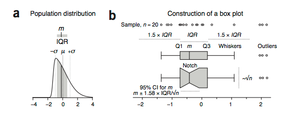
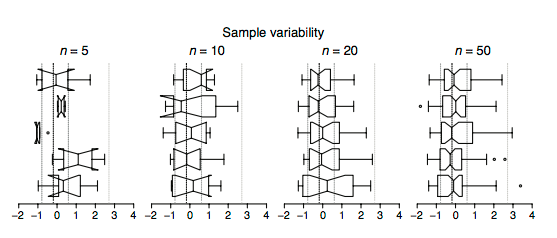
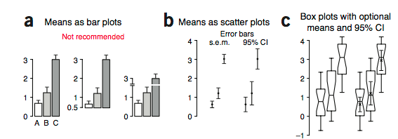

>Use box plots to illustrate the spread and differences of samples.

今天的POS又是让我受益匪浅的一篇，感觉获得了不少的东西。

## 箱线图 ##

### 箱线图和矩形图 ###

箱线图和矩形图有一个很大的差异，就是需要的样本数更少一些，如果用矩形图，一般要求样本size>30，而对于箱线图，样本size>5就可以做出能表现一定特征的图。

### 箱线图特征 ###

箱线图的盒子中的三条线分别表示25th, 50th and 75th percentiles，也可以说是lower quartile (Q1), median (m or Q2)和upper quartile (Q3)，而interquartile range (IQR = Q3 – Q1)，这个也经常使用。也就是在中心区域50%的样本所覆盖的区域。

箱线图对于离群点（outliers）不会很敏感。所以很适合用来描述一些有离群点且分布不平衡的数据集（这些数据集仅仅通过mean和s.d.并不能很好的进行描述）。

箱线图的长度是表示IQR的，但是宽度的意义并没有特别的明确，不过最好也是能够表示例如样本数目这样的信息，一般都是表示`\sqar{n}`n为样本数，这样一张图中的信息就会表现的更加多一些。例如上图 **b**中的两个箱线图，可以看出宽度不同，这样就可以知道统计的时候所用的数据数目上的差异。

箱线图的`线`也有两种形式，一种是 _Tukey style_，这种就是线的极限就是到1.5*IQR，超过部分就以离群点出现。另一种是 _Spear style_，就是直接包括最大值和最小值，也就是没有离群点这一说。

以上`箱`和`线`都有明确的规定，只能表示这些意义，不能用来表示mean,s.d.或者是s.e.m.

这种箱线图最好还是要求样本数大于5，如果样本数都不到5，最好还是用散点图。

### 箱线图的扩展-notch ###

第一张图中的b，下面一个箱线图就是加了notch的，这个notch表示的意义是CI，一般也就是$$m\pm 1.58*IQR/\sqrt{n}$$，就是图中斜的部分，如果样本数很少，可能斜的部分就已经超过了IQR，这样就会产生如下图一样的：

随着样本数的增加，会有改善

- 所以如果notch的CI超过的IQR，建议就不要使用notch.

**notch有一个好处，能够大致的评估出，两个样本是否显著差异，因为CI如果没有overlap，那么几乎就可以说是显著差异的。**

### bar图 ###

讲到box图，就说到一般的bar图，**强烈建议，不要使用bar图加error bar**

error bar使用在点图比较合适或者也可以加入到box图中。

很容易意义不明确。

### 最后一点说明 ###

在使用箱线图的时候，最好阐明，箱和线的意义，例如使用的是spear还是tukey，以及样本的数目，这些都能帮助读者更清晰的阅读文章。

