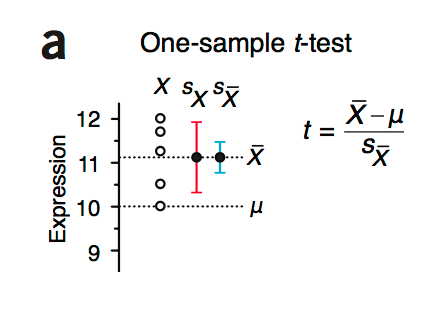
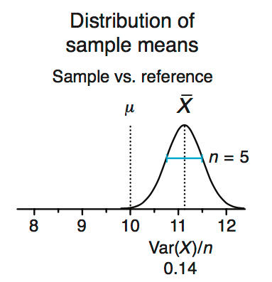
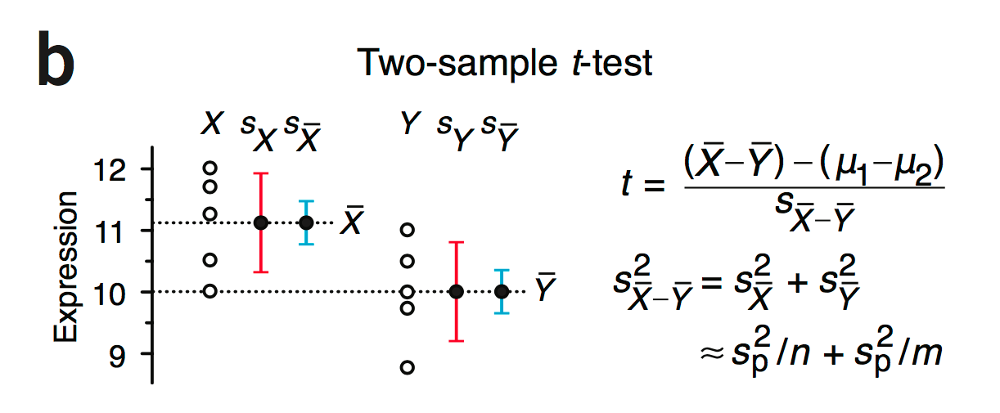
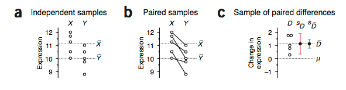

>Robustly comparing pairs of independent or related samples requires different approaches to the t-test.

**样本量少于30的才使用t-test吧，如果样本量大于30，使用z-test（u-test）**

### one-sample ###

还是以例子开始：

这是之前提到过的测量蛋白表达的那个例子，有一个自认为是reference的蛋白表达均值u，如图就是`u=10`，而我们测量的某一状态下蛋白的表达，测量了5次，表达分布如图所示，红色的error bar代表的是这5个样本的标准差（0.84），均值为11.1。蓝色error bar表示的是均值的标准差，也就是$$\sigma/\sqrt{n}$$。

上图如果以分布的形式画出如下图：

标准差=0.84，方差Var(X)=0.71。

这样可以使用one-sample t-test，$$t=\frac{\overline{X}-u}{S_{\overline{X}}}$$，t检验，直接查表，n=5，自由度`df=5-1`，t=2.93，检验发现p<0.05。

### two-samples ###

保持上面例子的条件，只是现在不存在reference，而是另一个样本集Y，而且样本集的size为m。

$$Var(X-Y)=Var(X)+Var(Y)$$

多个个体联合产生的不确定性（s.d.）就是不同个体自身的不确定性的（s.d.）之和。

倘若我们能确定两个总体的方差是相同的，那么我们就可以直接使用两个样本集中的所有样本的平均方差来估计总体方差`s_{p}^2`。

如果两个样本集的size相同，那么可以直接取平均

$$s_{p}^2=(s_{X}^2+s_{Y}^2)/2$$

倘若不等，那么就需要使用加权平均了（n-1，m-1）。

这样对于均值的方差，则有：

$$Var(\overline{X}0\overline{Y})=s_{p}^2/n+s_{p}^2/m$$

这样对于两类样本，X，Y就有了如上图所示的分布。

对于两个样本的比较，我们计算t的时候就如上图右边的公式

_我对公式的理解：公式中的u1和u2的计算是基于零假设的，也就是u1=u2，所以上述公式中的u1-u2其实为0，X的均值和Y的均值其实能够计算出，也就是上半部分其实和one-sample那个是相等的。但是下半部分，明显two-samples的要比one-sample的大，所以导致t值最后是有差异的。也就是同样的均值，可能出现不同的显著性。_

> For the one-sample case, we find t = 2.93 and a corresponding P value of 0.04. At a type I error cutoff of a = 0.05, we can conclude that the protein expression is significantly elevated relative to the reference. For the two-sample case, t = 2.06 and P = 0.073. 

**而且自由度也是有差异的df=m+n-2，也就是各个样本的自由度只和。**

### 注意事项 ###

>If all assumptions are satisfied, `a` = `t`, and our chance of committing a type I error is indeed equal to `a`. However, failing to satisfy assumptions can result in `t` > `a`, causing us to commit a type I error more often than we think. 	

当样本X和样本Y的size一样的时候，其实`t`只是略大于`a`。而当样本size不等的时候，这两者就有些大的差异（**具体获取方法不明**）

>For example, when the sample sizes are equal, testing at a = 0.05 (or a = 0.01) gives t < 0.06 (t < 0.015) for n ≥ 15, regardless of the difference in population variances. If these sample sizes are impractical, then we can fall back on the result that t < 0.064 when testing at a = 0.01 regardless of n or difference in variance. 

而且样本之间的相关性要没有，就是应该是独立的样本集。（这个没想好合适的例子）文章中说明，如果样本间具有相关性，那么`t`和`a`的关系也会受到影响。

### 配对样本处理 ###

相当于评估的是表达差值的均值是不是为0，也就是和one-sample一样。所以这样所获得的P值也可能显著P = 0.02 (t = 3.77) 。

