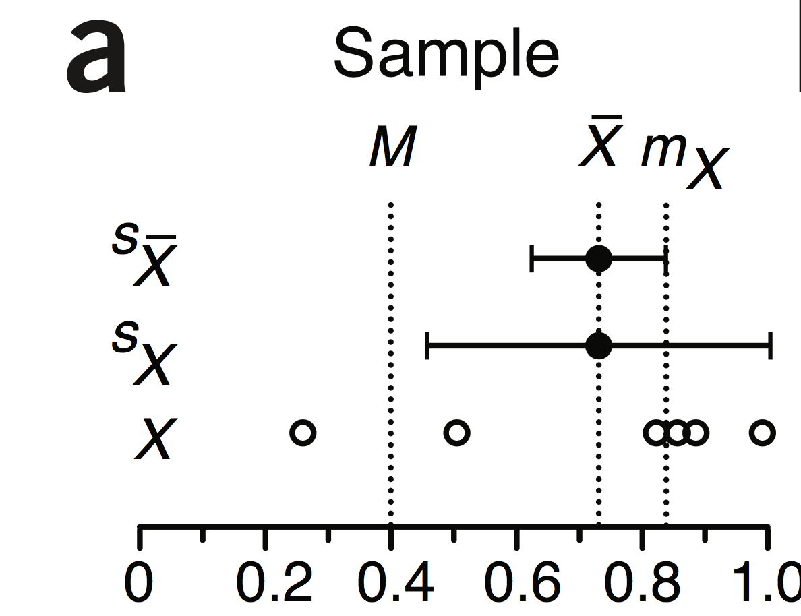
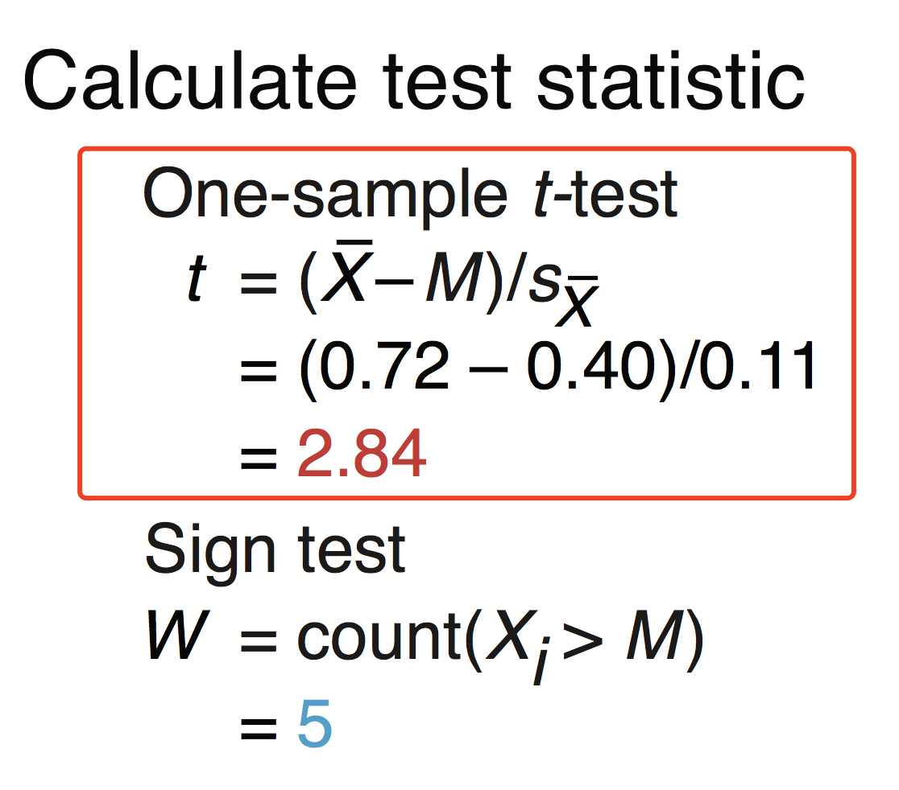
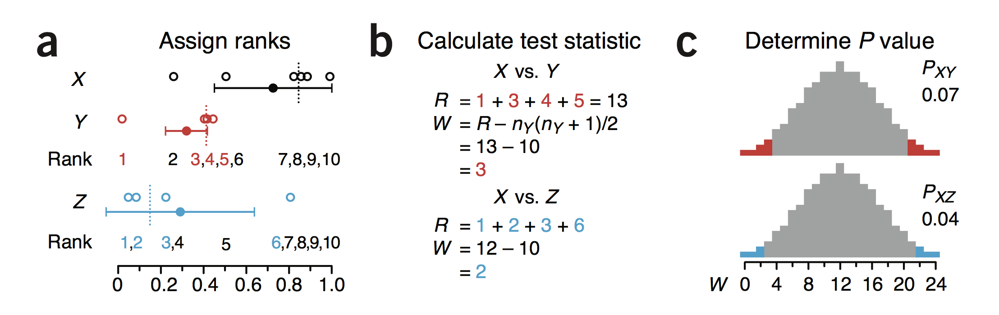
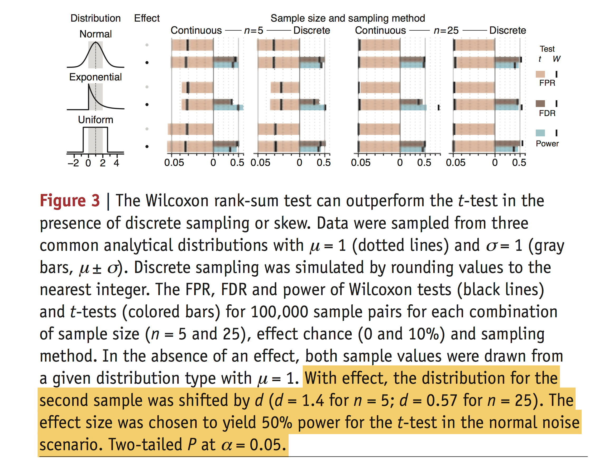

**Nonparametric test robustly compare skewed or ranked data.**

对于分布已知的检验可以使用t-test（正态分布），但是对于总体分布未知，或者有偏的分布，则会使用到 **Nonparametric test**

**Nonparametric tests**：sign／Wilcoxon rank-sum tests

>Nonparametric tests such as the sign and Wilcoxon rank-sum tests relax distribution assumptions and are therefore easier to justify, but they come at the cost of lower sensitivity owing to less information inherent in their assumptions. 

1. 正因为，他的已知条件更少，所以他对于检验的敏感性更低一些，表现出来的就是例如符合正态分布的t-test检验出来是显著的差异，但是利用Nonparametric test则是不显著差异的。
2. 后面还会说到，他本身对于P value就有一些限制（小样本量），所以无法达到特别小的值。

## 单样本检验

上图就是一个单样本检验的例子，假设我们只知道，样本的总体的中值`M=0.4`，而X是样本的6个抽样，值如图所示。

如果我们利用t-test来检验这个样本是否符合总体的分布，我们可以得到如下图（红框中）所示的计算：

查表可知，`t=2.84`，则`p=0.04`，也就是我们这个样本M是与总体显著差异的（0.05为阈值）。

下面我来描述一下 **Nonparametric test**：

因为不知道分布，所以只能利用中值来进行检验，中值的特性就是不管是什么样的分布，中值左边的点（小于中值）和中值右边的点（大于中值）的数目是相等的。所以对于单样本的非参数检验，主要计算的是W值。

**W值**的含义是中值其中一边的抽样点的数目，如上图所示。

_图中一共6个点，其中5个点再M的一边_

$P value=C^{1}_{2}C^{5}_{6}p^{5}(1-p)^{1}+C^{1}_{2}C^{6}_{6}p^{6}$

因为是中值，所以一个点落在中值的左边或者右边是服从`p=0.5`的二项分布，所以P value = 0.22，即便只计算单边，p=0.11，也是属于不显著的。所以相对于t-test，sign test的确敏感性“不足”。

>This is because it is not influenced by the actual distance between the sample values and M—it measures only ‘how many’ instead of ‘how much’. 

**通过上述的公式，我们也能发现即使处于一种很极端的方式，就是所有的6个点都在M的一边，P=0.03，也就是P值是有极限的。**

## 多样本检验

**多样本检验一般使用Wilcoxon rank-sum test**

秩和是一件很有意思的事情。

如上图所示，是X和Y，Z进行比较（XY，XZ），首先看X，Y的比较，将X与Y的抽样样本进行排序，这里面X一共6个点，Y是4个点，所以以样本点较少的样本进行计算，计算排秩后的和，如图中红字所标注。
`sum(Y)=1+3+4+5=13`那么Y中的四个点，最小的秩和是`1+2+3+4=n(n+1)/2=10`，则计算量`W=13-10=3`。这个W的值在所有可能性下发生的概率就是P值。首先我们讨论一下这个W值的范围，W肯定是在[0,nx*ny]中的。那么穷举所有的可能性，共210种排列的可能（C^{ny}_{ny+nx}），通过计算有14种可能的组合使得W<=3或者>=21，那么`p=0.067`。

>ForXversusZ,W=2,and PXZ = 8/210 = 0.038. For cases in which both samples are larger than 10, W is approximately normal, and we can obtain the P value from az-testof(W–mW)/sW,wheremW =n1(n1 +n2 +1)/2andsW = √(mWn2/6).

而这种情况下，p值是有极限的，1/210=0.005就是极限p值了，这还是只计算one-tail的情况下。所以按照一般的情况下，我们能够拒绝null的可能性很低，而且没有办法刚好确定我们的a=0.05，所以一般直接使用我们计算的p值作为一型错误的可能性。

还有一种情况，那就是如果不是做单次检验，而是做多重检验，那么当我们进行p值矫正的时候，很有可能什么样的情况下，我们都不可能得到显著的结果。

>To achieve two-tailed significance at a = 0.05 across N = 10, 100 or 1,000 tests, we require sample sizes that produce at least 400, 4,000 or 40,000 distinct rank combinations. This is achieved for sample pairs of size of (5, 6), (7, 8) and (9, 9), respectively.

需要有数据量的支持，才可能获得到显著的结果。

>The P values from the Wilcoxon test (PXY = 0.07, PXZ = 0.04) in Figure 2a appear to be in conflict with those obtained from the t-test (PXY = 0.04, PXZ = 0.06). 

这种情况产生的原因，因为Wilcoxon关注的是Median，而t-test关注的是mean。对于不对称的样本分布，这种差异就会显得特别明显。而且t-test会受到任意一个值（小样本）的变化而变化，也就是极值会影响t-test，但是对Wilcoxon的影响却几乎没有。后面的这个图是一个很好的说明：

有关于图的说明，虽说已经截图下来，但是还是有一些内容我觉得还是需要详细说明一下。

1. 首先，构建的是三个不同分布的样本总体，而这三个不同分布的样本总体的均值和标准差都是一样的，`u=1,\sigma=1`，只是他们的分布有所不同，第一个是 **正态分布**，第二是 **有偏的分布**，第三个是 **均匀分布**。
2. 做比较的样本数是5/25（这点需要说明，不是一组样本数为5，另一组样本数为25，然后这两组进行比较，而是5和5比，25和25比，设置了两个不同的数量而已）。
3. 然后有差异的size（effect chance）设置2种，一种是0，一种是10%，总共样本量为100000.也就是在这100000个比较中，对于effect chance为0的情况，会有0个真实差异的比较，而对于effect chance为10%的情况，会有10000个真实差异。
4. 而差异对于sample size为5和25的不同，分别是1.4和0.57（很贴心的说明了，为什么差异会选取这两个值，就是保证t-test能够有50%的power，所以在途中也能看到，t-test的power几乎就是50%）。
5. 图中上面的表示effect chance为0，下面的为10%

**说明，图中的Continuous和Discrete没有太明白区别**

### 最后一张图的说明

FPR=FP/(FP+TN)
FDR=FP/(FP+TP)

1. 对于Normal分布，在样本数量较少（`n=5`），FPR的评估，Wilcoxon的性能要好于t-test，其实也和本身Wilconxon的敏感性要低一些有关。而在大样本（`n=25`），性能上的差异则不大。

2. 对于Exponential分布，Wilcoxon的各项性能就要优于t-test，特别是在大样本。

3. 对于Uniform分布，则于normal分布结果差不多。

>At n = 5, Wilcoxon FPR = 0.032 < a because this is the largest P value it can produce smaller than a, not because the test inher- ently performs better.

			