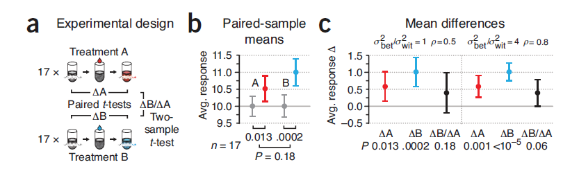

**这一篇看的时间看的比较长，几乎会每天都读一遍，然后加深印象。虽说整篇说明的问题不多，但是感觉这个信息量刚刚好**

## 一个假设实验说明

- 我们通过前面几次的POS的了解，我们知道如果我们有一个预估的检测power（就是对于阳性样本或着显著差异的样本，有大的可能性检测出），并且规定好\alpha，并且知道effect size（d），就能通过一个公式计算出我们大致需要的样本数来支持我们的实验结果。

所以文中有一个假设实验：

![<en-media type="image/png" hash="b0d99210cb37972ff58bd453767ae5c8"/>]](../pics/pos9-1.png)

一共设置了3个状态，分别是A处理，B处理，和C（control，不处理），而且假设了B和C的effect size为1，A和C的effect size为0.6，而C本身的均值为10。规定我们需要检测出B与C之前的差异的power为80%，计算获得，我们需要一个factor中n=17，也就是17个样本每种状态，但是在这个样本数下，A与C的检测差异的power就只有40%。

## 实验结果

*如上图中所示，a图中表示的就是实验中预计的差异，以及A/C，B/C的effect size差异*

- 通过差异检测方法（t-test，非配对样本），能够获得B/C之间的差异p value=0.009，而A/C之间的差异p value=0.18，B/A之间的差异p value=0.15`（这点是我比较奇怪的，正常来说，A和C之间的差异应该要大于A和B之间的差异，但是出来的P值，A和B之间的p值反而要更小一些？？？）`正如上图b中所示

- 我们在很多科研中看到的图表示差异的都是b这样的图，但是文中很明确的指出，这种图给出的信息太过少，应该使用c图这样的。

- c图的纵坐标表示的两组（A/C）之间均值的差异的分布，能够够好的说明effect size和p值。很明显在图中A和C之间的均值差异经过0，B和A的也是经过0，所以他们之间不显著差异。

>Significance itself is a hard boundary at P = α, and two arbitrarily close results may straddle it. Thus, neither significance itself nor differences in significance status should ever be used to conclude anything about the magnitude of the underlying differences, which may be very small and not biologically relevant.

文中还给出了一个信息，就是刚刚看到的A和B不显著差异，而B和C显著差异，并不能得出A和C就是显著差异的。**并不存在这种简单的推断关系**，这个也能够解释我上面所提到的我的疑惑，就是A和C明明应该更大差异，但是**从P值上来却比B和A之间的差异还要小（P值越小说明差异越大）**，**P值的数值不能反应出这个量级的关系**

## 那A和C之间的差异我们怎么才能找出来呢？

由于现实中，我们有的时候的确需要进行这样的检测，就是他们的确不是来自一个总体分布，但是effect size又太小，有一种方法就是无限的加大sample size，一定会到达显著的效果，但是对于科研（其实不论对于什么问题，除非数据来自计算机模拟），加大sample size意味着更大的经费投入。

所以文中给出了一些建议方法。

## 两个比较重要的概念

![pos9-2]](../pics/pos9-2.png)

### within-subject variantion

也就是样本内的变化差异，如上图a中，对于用一个样本测了三次，分别得到x1,x2,x3，这个三个值，他们之间的差异就是wit（within-subject variantion），这种差异主要来源于实验或者技术手段的固有差异，或者是时间上的差异（毕竟测三次，不能同时测）。图中y1,y2,y3也是这种。

### between-subject variantion

这种就是样本之间的差异，即使x样本和y样本是在同一个factor下的（例如都没有经过任何药物处理），但是测到的实验值，也会有差异，如上图b中的差异，就是bet。

### 他们的影响？

有了wit和bet就能比较好的说明解释用什么方法可以比较好的利用有限的样本检测出effect size比较小的factor之间的差异。

我们现在假设我们只有一个样本，那么他的差异是没有的（自己和自己怎么能有差异），现在又加入另一个样本，进行检测，这个时候他们的差异不止有wit（如果他把自己在测一次，那么只有wit），还有bet，也就是本身同一个factor下，变化的差异就会比较大了。

现在我们想象，两个在图中靠很近的两个点，如果他们本身的半径很大，那么那他们很可能重合的就很多，但是如果他们本身的半径很小，那么他们之间的差异其实很明显的。

如果我们使用unpair的样本，相当于我们只能计算两个点中重合部分的大小，但是当我们使用pair的样本，那么a只会和a1比，这个差异就更好控制。

### 一个例子说明

例如做一个实验，连续吃一个月汉堡和连续吃一个月油条，那个增重更加厉害。

油条组（1个月前）：60kg，80kg
汉堡组（1个月前）：60kg，90kg

油条组（1个月后）：80kg，110kg
汉堡组（1个月后）：75kg，115kg

我们首先想到的是，我们肯定是计算差值，首先油条组，增重20kg，30kg；汉堡组增重15kg，25kg.如果只计算均值，其实差异并不大，但是如果我们认为原本60kg和60kg是同一个样本（因为体重相同，我们认为在相同摄入的情况下，他们的体重增减是相似的），那么他们之间的差异其实就要显著的多**（例子举的不太好）** 但是希望意思能够理解。

### 相同样本量上如果认为是配对样本

结果就如上图，非常的显著，即便是判断B与A组之间的差异都能看出显著差异。

**可能还有一个疑问，就是图中的p是什么，这是一个假设的wit的描述，相当于，我测量两次相同样本，他们之间的相关性，相关性越大，说明wit约小，如果相关性越小，说明本身实验技术手段对于同一个样本的检测就有很大的变化，所以会造成很大的差异，也就是wit会很多大，会造成不好的影响**

**所以这个配对是解决样本量不足的一个非常好的方法**

